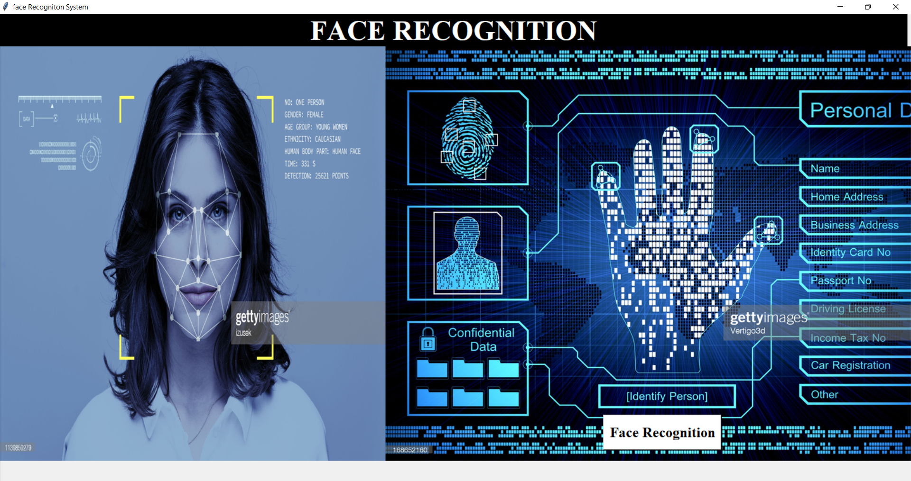
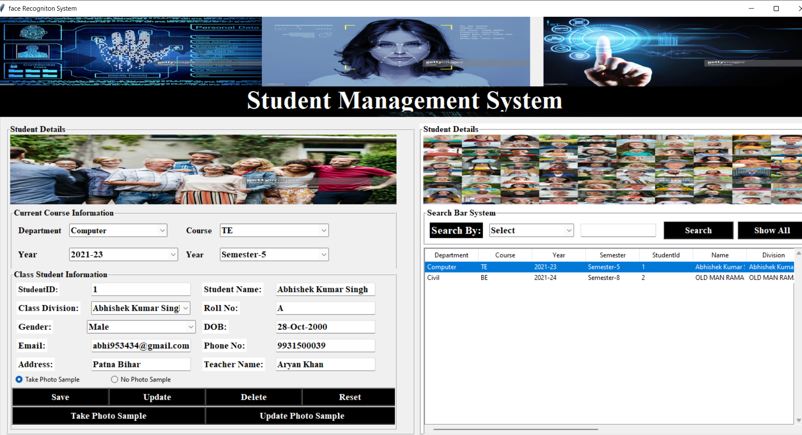
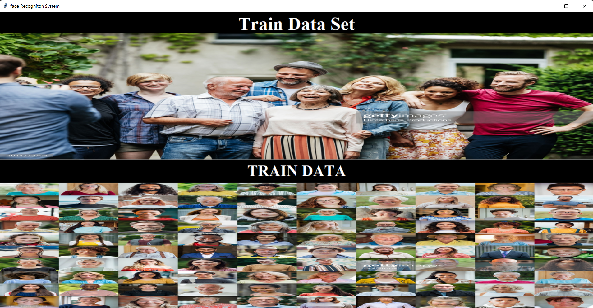
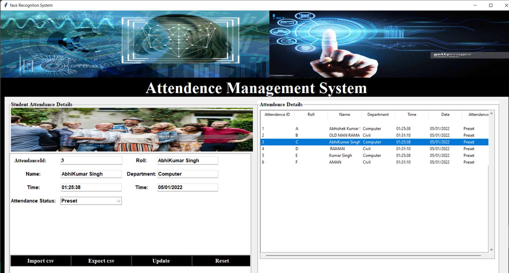
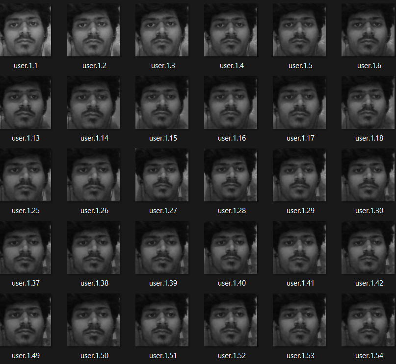
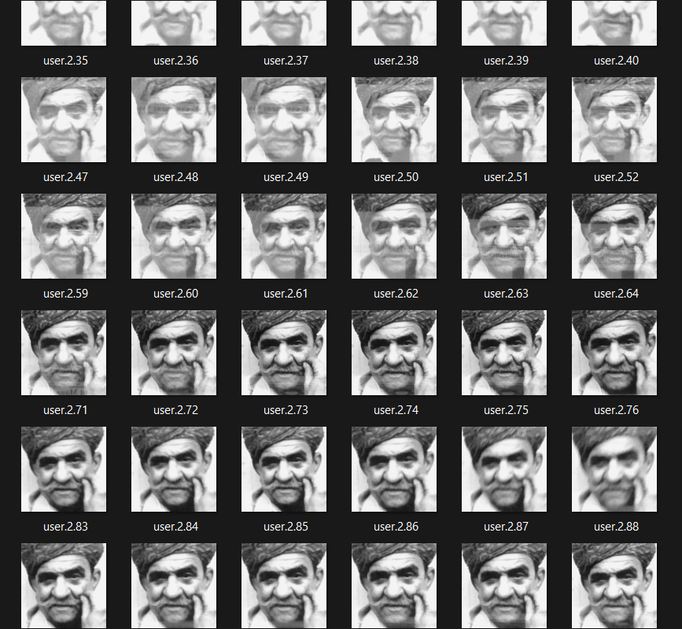

# Facial Recognition & Identification System
This Repository contain Code for Facial Recognition and Identification using Open CV and Python with tkinter GUI interface.

### ✨DISCRIPTION 
 

- __Facial Recognition & Identification based attendance system__”.
Attendance of students in a large classroom is hard to be handled by the traditional system, as it is time-consuming and has a high probability of error during the process of inputting data into the computer, Our project proposed automated attendance marking system using face recognition technique. The system deployed __Haar cascade classifier__ to find the positive and negative image of the face and __LBPH__ (Local binary pattern histogram) algorithm for face recognition by using python programming and OpenCV library. Here we use the __tkinter__ GUI interface for user interface purpose.

## 🪧 Demo video

You can checkout the demo video on youtube by clicking on the thumbnail below.
<a href="https://youtu.be/">
  
</a>

### 📎  STATEMENT OF PROBLEM:
- Attendance of students in a large classroom is hard to be handled by the traditional system, as it is time-consuming and has a high probability of error during the process of inputting data into the computer. Our project proposed automated attendance marking system using face recognition technique. RESULT: The system deployed __Haar cascade__ classifier to find the positive and negative of the face and __LBPH (Local binary pattern histogram) algorithm__ for __face recognition__ by using python programming and __OpenCV library__. Here we use the __tkinter GUI__ interface for user interface purpose. Firstly, our app asks to fill the details of the student you can click on  the __student details__ section of page and take image of the particular student. It takes __100 images__ as sample and store them in folder Training Image. After completion it notify that images __trainig completed__. After taking image sample we have to click Train Image button. Now it takes few seconds to __train machine__ for the images that are taken by clicking Take Image button and creates a __classifier.xml__ file and store in Photos section you can see your image on simple clicking on the photos section page. Now all initial setups are done. By clicking Track Image button camera of running machine is opened again. If face is recognized by system then __Id__, __Name__ , __roll number__ and __department__ of person is shown on Image with green color. if face is not match then it show __Unknown face__ in red color . Press exit button for quit this window. The attendance of the student was updated to the Excel sheet after student's face has been recognized you can simply click on the attendence section to import and export the data which you want .

  __Brief__
- __Harrcascade__ - basically a machine learning approach , where cascade function used to train the both the positive and negative images after that using that image to detect other object.


- __LBPH__(Local Binary Pattern Histogram) it is used to recognize the face of person.Its a simple yet very efficent texture operator which labels the pixels of an image by thresholding the neighborhood of each pixel and consider the result as a binary number.


 


## 💻 Technologies Used
* Python
* OpenCV
* Tkinter GUI
* MySQL
* VS CODE (IDE)


## 🤝 Credits

- LBPH Algorithms: [Refrence](https://towardsdatascience.com/face-recognition-how-lbph-works-90ec258c3d6b)

- Haar Cascade Algorithms: [Refrence](https://towardsdatascience.com/face-detection-with-haar-cascade-727f68dafd08)

## 🚀 Main Features

- Interactive 3D Models
- Learn with Augmented Reality
- Discuss with other students in the chatroom
- Available in multiple languages
- Chatbot Assistant
- Fun games


## 📃 Pages

- Login/Sign Up
- Face Detector page
- Student Details page
- Train Data page
- Attendence page
- Photos page

## 🖼️ Some glimpse of the project

✔️Facial recognition and identification(Home Page)


✔️Face Recognition(Face Detector Page)


✔️Student Management System(Student Details Page)



✔️Train your Dataset(Train Data Page)



✔️Import and Export your details (Attendance Page)


✔️Photos that you trained (Photo Section Page)



## 🔰 Installing and Running

From the project folder, click these button in individual to run the test:
```
To run code:
1.Go to the section you want to run
2.Use shortcut Ctrl + Alt + N
  or press F1 and then select/type Run Code,
  or click the Run Code button in the editor title menu
  or click Run Code button in the context menu of file explorer

``` 
from terminal 
1. cd to `facerecognisationsystem`
2. type in terminal `python yourfilename.py`

## How to use harrcasecade algorithm

```
  Step by Step 
  1. search Python3.9
  2. Right click -> open file location
  3. Go to Lib Folder 
  4. Go to site-packages
  5. open the cv2 folder
  6. go on data 
  7. here you find harrcascade_fronatalface_default in XML 
  
  copy the file on your working folder and use it . 
```


## 🐛 Bug Reporting

Feel free to [open an issue](https://github.com/abhishekrawe/Facial-Recognition-Identification/issues) on GitHub if you find any bug.

## ⭐ Feature Request

Feel free to [Open an issue](https://github.com/abhishekrawe/Facial-Recognition-Identification/issues) on GitHub to request any additional features you might need for your use case.

## ♻️ Contributing

* **Abhishek Rawe** - *Developer* - [Website](https://www.linkedin.com/in/abhishekrawe/)

## ❤️Authors

* **Abhishek Rawe** - *Developer* Who's the author of those contents - [Abhishek Rawe](https://www.linkedin.com/in/abhishekrawe/)

## 📜 License

This software is open-source, licensed under the [MIT License](https://github.com/abhishekrawe/Facial-Recognition-Identification/blob/main/LICENSE).

[](https://github.com/abhishekrawe)


